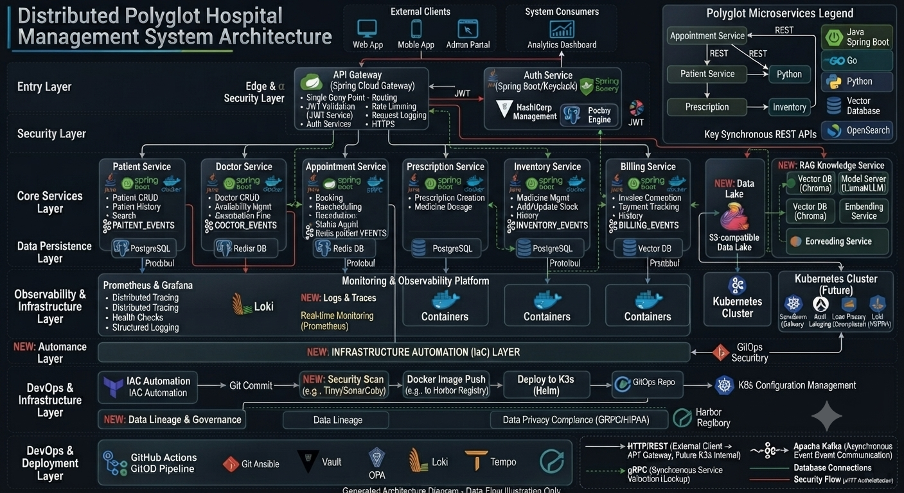

<div align="center">


[](https://github.com/HariDev-eng)


</div>

<br>

## 🚀 About Me

I'm a backend developer passionate about building scalable systems and understanding **why** software is designed the way it is.

I graduated with a **B.Tech in Information Technology** and completed a **10-month internship at Marmin Technologies**, where I worked on REST APIs, financial document workflows, webhook delivery systems, RabbitMQ, a SaaS compliance platform, PostgreSQL, and Go backend services.

Today I'm focused on learning backend engineering by building **real distributed systems** instead of isolated tutorials. My goal isn't just to write code — it's to understand architecture, scalability, and the engineering trade-offs behind production software.

> *Learn by Building • Improve by Refactoring • Understand by Documenting*

<br>

## 🏥 Flagship Project — Distributed Patient Management Platform

A healthcare platform built from scratch using **microservices** and **event-driven architecture** — my primary vehicle for learning backend engineering properly.

<div align="center">

</div>

### Services & Status

| Service | Responsibility | Status |
|---|---|:---:|
| 🌐 API Gateway | Centralized routing & request forwarding | ✅ |
| 👤 Patient Service | Registration & profile management | ✅ |
| 👨‍⚕️ Doctor Service | Profiles, availability, specialization | ✅ |
| 🩺 Nurse Service | Nurse assignment & ward management | ✅ |
| 📅 Appointment Service | Scheduling & lifecycle | ✅ |
| 🧾 Diagnosis Service | Medical diagnosis & patient history | ✅ |
| 📦 Inventory Service | Medical inventory management | ✅ |
| 🔔 Notification Service (Go) | Email, SMS, in-app notifications | 🚧 |
| 🔐 Authentication Service | JWT authentication & authorization | 🚧 |
| 🐳 Docker Deployment | Containerizing every service | 🚧 |
| ☸️ Kubernetes | Orchestration | 📅 Planned |

### Communication Patterns

<table>
<tr><td width="25%"><b>REST</b></td><td>Client ↔ Gateway, and general external service access.</td></tr>
<tr><td><b>gRPC</b></td><td>High-performance sync calls between services — e.g. Appointment → Patient Verification, Appointment → Doctor Availability.</td></tr>
<tr><td><b>Kafka</b></td><td>Async domain events — e.g. <code>Appointment Created → Kafka → Notification Service</code>.</td></tr>
<tr><td><b>RabbitMQ</b></td><td>Background worker queues — Notification → RabbitMQ → Email / SMS / In-App workers.</td></tr>
</table>

### Concepts Implemented

`Microservices` `Event-Driven Architecture` `CQRS` `Event-Carried State Transfer` `API Gateway` `JWT Authentication` `Protocol Buffers` `Repository Pattern` `Builder Pattern` `Factory Pattern` `Clean Architecture`

**Stack:** `Spring Boot` `Go` `React` `PostgreSQL` `Kafka` `RabbitMQ` `gRPC` `Protocol Buffers` `Docker` `JWT`

🔗 [Backend Repo](https://github.com/HariDev-eng/Patient-Management-System) · [Frontend Repo](https://github.com/HariDev-eng/patient-management-ui)

<br>

## 🧰 Other Projects

<table>
<tr>
<td width="50%" valign="top">

### 🎬 Concurrent Movie Seat Booking
Preventing double-booking under heavy concurrency. Implements and benchmarks three strategies:
- ✅ In-Memory
- ✅ Mutex Protected (`sync.RWMutex`)
- ✅ Redis Atomic `SET NX`

Interface-driven storage, goroutines, and concurrent load testing.

`Go` `Redis` `Goroutines` `REST APIs` `Clean Architecture`
[Repo →](https://github.com/HariDev-eng/concurrent-movie-booking)

</td>
<td width="50%" valign="top">

### 🔗 Event-Driven Webhook Processing
A webhook platform inspired by Stripe and GitHub, built to understand asynchronous event delivery.
- Event-driven processing
- Retry mechanism with async workers
- Producer/consumer architecture on RabbitMQ

`Go` `RabbitMQ` `REST APIs` `Webhooks`
[Repo →](https://github.com/HariDev-eng/Event-Driven-Webhook-Processing-System)

</td>
</tr>
<tr>
<td width="50%" valign="top">

### 📝 Blog Platform
A secure REST backend with role-based access control.
- JWT Authentication + Spring Security
- Role-Based Access Control
- Categories, tags, full CRUD APIs

`Spring Boot` `Spring Security` `JWT` `PostgreSQL`
[Repo →](https://github.com/HariDev-eng/Blog-App)

</td>
<td width="50%" valign="top">

### 📚 Backend Architecture Handbook
Living documentation of every major architectural decision made across these projects — the "why," not just the "what."

`Documentation` `ADRs`

</td>
</tr>
</table>

<br>

## 🧠 Learning Roadmap

<details>
<summary><b>Backend</b></summary>
<br>

- [x] REST APIs
- [x] Spring Boot
- [x] Go
- [x] gRPC
- [x] Kafka
- [x] RabbitMQ
- [ ] Authentication & Authorization
- [ ] Docker
- [ ] Kubernetes
- [ ] AWS

</details>

<details>
<summary><b>Software Architecture</b></summary>
<br>

- [x] SOLID Principles
- [x] Clean Architecture
- [ ] Domain-Driven Design
- [ ] CQRS
- [ ] Event-Driven Architecture
- [ ] Event-Carried State Transfer
- [ ] Distributed Messaging
- [ ] Architectural Decision Records (ADRs)

</details>

<details>
<summary><b>Distributed Systems</b></summary>
<br>

- [x] Kafka
- [x] RabbitMQ
- [ ] Retry Strategies
- [ ] Dead Letter Queues
- [ ] Transactional Outbox
- [ ] Idempotency
- [ ] Eventual Consistency
- [ ] Distributed Transactions

</details>

```
Backend Development → Microservices → Event-Driven Systems
      → Distributed Systems → Software Architecture
      → Cloud Native Engineering → Platform Engineering
```

<br>

## 🛠 Tech Stack

<div align="center">

**Languages**


**Backend**


`REST APIs` `Protocol Buffers` `Spring Security` `Webhooks`

**Databases**


**Frontend**


**DevOps & Tools**


*Currently learning:*


</div>

<br>

## 📊 GitHub Insights

<div align="center">

<table>
<tr>
<td></td>
<td></td>
</tr>
</table>


</div>

<details>
<summary><b>Cards showing broken?</b> — click for the fix</summary>
<br>

The shared `github-readme-stats.vercel.app` instance is community-run and shares its GitHub API quota with every profile using it — so it fails often, and that's expected to keep happening rather than resolve itself. In fact the original project has stopped active development and now points users to its actively maintained successor, **GitHub Stats Extended**. `cache_seconds=86400` (added above) tells it to serve a cached image for 24 hours once it does succeed once, which cuts down on repeat failures — but it's a mitigation, not a fix.

The durable fix is to stop calling a live API on every page view entirely:

1. **GitHub Actions workflow (recommended)** — Use a workflow that runs on a schedule, generates the stats card as a static SVG, and commits it straight into your profile repo. Since the image is then just a file in your repo (not a live API call), it can't be rate-limited by traffic to your README. Search "github readme stats action" for ready-made workflows that do this.
2. **Self-host on Vercel** — Fork [anuraghazra/github-readme-stats](https://github.com/anuraghazra/github-readme-stats), deploy to your own free Vercel project, generate a GitHub PAT (classic, no expiry, `repo` + `read:user` scopes), set it as `PAT_1` in your Vercel env vars, then swap the domain in every URL above for your own deployment. You get your own quota, separate from everyone else's.

Option 1 is the more permanent fix since it removes the live-call dependency altogether; option 2 still depends on live calls, just with your own rate limit instead of the shared one.

</details>

<br>

## 🌱 Beyond Code

🏋️ Working out · 📚 Reading about distributed systems and software architecture · 📝 Documenting what I learn · 🧩 Solving algorithmic problems · 🚀 Building side projects to test new ideas

<br>

## 🎯 2026 Goals

- [x] Build a distributed healthcare platform
- [ ] Deploy every service with Docker
- [ ] Learn Kubernetes
- [ ] Learn AWS
- [ ] Build CI/CD pipelines
- [ ] Complete the Backend Architecture Handbook
- [ ] Contribute to Open Source
- [ ] Land a Backend Engineer role

<br>

<div align="center">

*Building in public — reach out if you're working on distributed systems too.*

</div>
